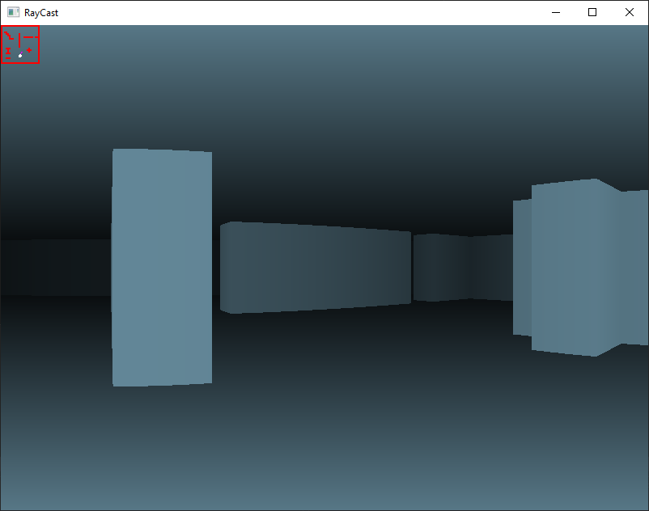

# Simple Wolfenstein3d Like Game

This was a highschool project that i made driven by my interest in the Wolfenstein3d and Doom games. My goal with this project was to explore and learn the math behind raycasting algorithms which were used to imitate 3d space in the 90s video games. Math involved is puerly two-dimensional and depth is simulated with a color gradient.
 

 

User can create his own map in a txt file and change the tint of the walls.
Minimap is rendered in the top-right of the screen.
Walking is implemented with the standard wasd keys.
